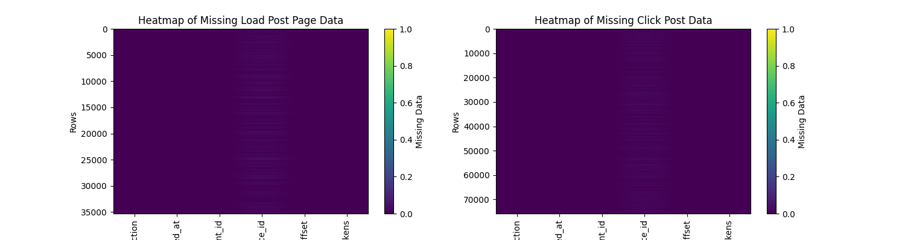
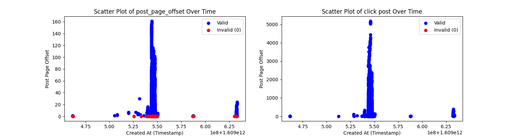
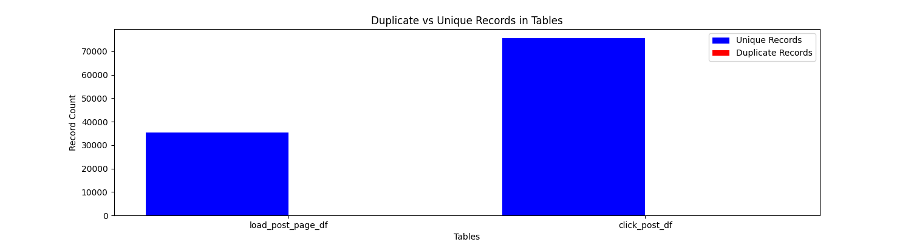

### Initial Data Exploration and Identification of Potential Errors

During the initial exploration of the data, it was observed that the `action` column in both the `load_post_page_df` and `click_post_df` tables consists of two distinct values: **`load_post_page`** and **`click_post`**. These two values represent different actions taken by users—loading a page and clicking on a post, respectively. Since these actions are complementary but represent distinct events, they should be separated for analysis to better understand user behavior in each scenario. This separation is crucial to ensure accurate insights into user engagement and interaction patterns.

In addition to this observation, several data issues were identified that may impact the quality of analysis. Below are five key errors discovered in the data, along with suggested methods for visualizing them.

#### 1. Missing Values
In the `device_id` column of both tables, missing values were found. These missing entries can cause issues in analysis, particularly when trying to group users by their device types. If not handled properly, missing `device_id` values can lead to incomplete insights about user segmentation.

#### 2. Invalid Values
In the `post_page_offset` column, there are values like 0, which might be considered invalid or inconsistent. This column represents the number of pages a user has browsed, and a value of 0 might imply that no pages were viewed, which conflicts with the "load-post-page" action.

#### 3. Record Mismatch
A notable issue is the mismatch in the number of records between the two tables. The `load_post_page_df` table contains 35,287 records, while the `click_post_df` table has 75,796 records. This difference suggests some events may not have been tracked consistently across both actions, which could lead to incomplete analyses if not addressed.

#### 4. Outliers
In the `post_index_in_post_list` column of the `click_post_df` table, there are abnormally large values that could be classified as outliers. These extreme values might indicate either unusual user behavior or potential data entry errors, which could distort the analysis if left unexamined.

#### 5. Duplicate Records
There is a possibility of duplicate records in both tables, which could skew the analysis if not handled properly. Duplicate records artificially inflate the data and may lead to inaccurate conclusions if they aren’t removed.

---

#### Dark Query Percent (less than 10 results): **98.75%**
The **Dark Query Percent** refers to the percentage of queries where fewer than 10 results were displayed to the user. In this analysis, we found that **98.75%** of the queries returned less than 10 results.

##### How we calculated this:
1. We filtered the data from the `load_post_page_action` table to identify instances where the `post_page_offset` (indicating the number of pages or results viewed) was less than 10.
2. We then calculated the total number of unique queries by counting distinct `source_event_id`s in the dataset.
3. Finally, the percentage of dark queries was computed by dividing the number of queries with fewer than 10 results by the total number of queries, multiplied by 100 to express it as a percentage.

This high percentage indicates that the vast majority of queries returned a small number of results, which might suggest a need to improve the system's ability to fetch more relevant content or expand the scope of the queries.

#### Bounce Rate: **37.05%**
The **Bounce Rate** measures the percentage of queries where users did not click on any of the results. A bounce can be defined as when a user views the results of a query but leaves without interacting further by clicking on a post.

##### How we calculated this:
1. We performed a join between the `load_post_page_action` table and the `click_post_action` table using the `source_event_id` as a foreign key.
2. Queries that appeared in the `load_post_page_action` table but had no corresponding entries in the `click_post_action` table were considered "bounced" (i.e., no clicks occurred).
3. We then divided the number of bounced queries by the total number of queries to get the bounce rate.

This rate of **37.05%** suggests that over a third of all queries resulted in no user engagement through clicks. This could be an indicator that either the displayed results weren't relevant enough or that users quickly found what they were looking for without needing to click further.

### Conclusion
By separating the `load_post_page` and `click_post` actions for analysis and addressing the identified data issues, the quality of insights derived from the data will be significantly improved. Using visual tools such as heatmaps, scatter plots, and box plots, we can effectively display these errors and communicate the necessary steps to clean the data for further analysis. This preparation is vital for ensuring that the datasets are ready for more advanced exploration and accurate results.
